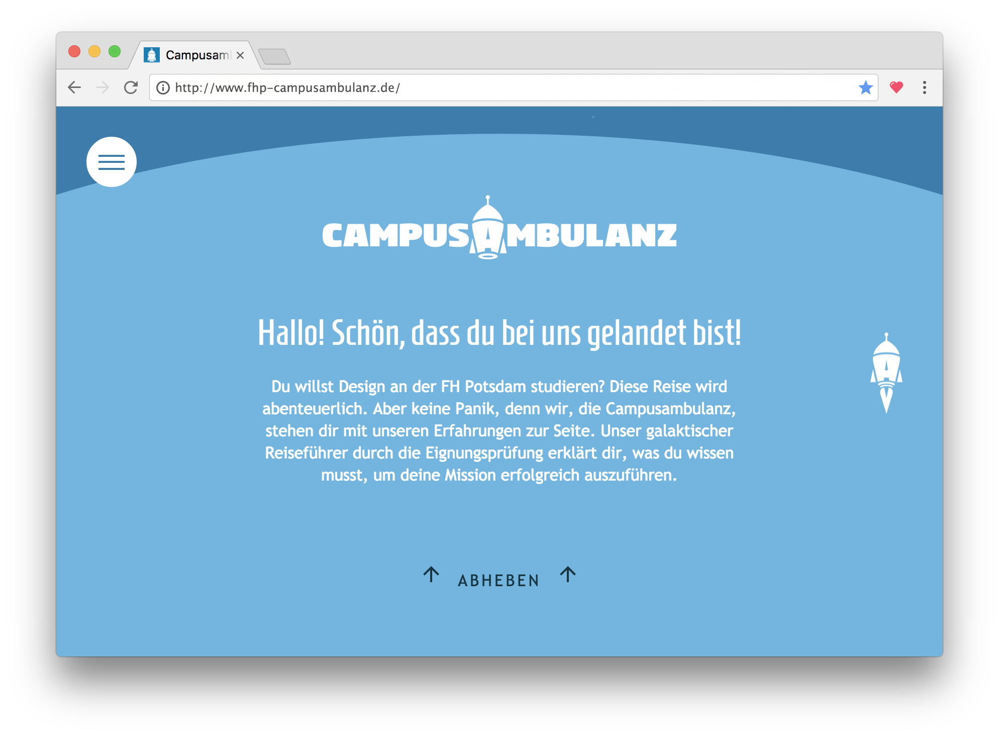

# CAMPUSAMBULANZ (FH Potsdam)

Herzlich Willkommen in unserem Campusambulanz-Repo. Hier findest du alle Zutaten und Gewürze mit denen wir die Webseite bauen.

## Anforderungen
- [node.js](https://nodejs.org/en/)
- [gulp.js](http://gulpjs.com/)

## Installation
Installiere zunächst node.js und folge dann dieser Anleitung.

```
// klone dieses Repository
git clone https://github.com/Campusambulanz/ca-website.git

// wechsel in das Repository Verzeichnis
cd ca-website

// installiere gulp global
npm gulp install -g

// installiere alle erforderlichen node module
npm install

```

## Start
Wenn alle benötigten node Module installiert wurden, kannst du nun das Projekt mittels gulp starten:

```
// einmalig (in deinem repository wird nun ein /build verzeichnis erstellt)
gulp init

// danach (gulp beobachtet jetzt nur noch Veränderungen)
gulp serve

```

## Struktur

(dev) Treemap zeigen, zusammenhang zwischen src/build views/css(less) erklären!


## Inhalte ändern
Einfache Änderungen können in der admin.jade-Datei gemacht werden. In dieser sind alle nötigen Schritte erklärt. Dazu gehören: Termine ändern, Sponsoren ändern und einzelne Sections ein- oder ausblenden. Diese Aufgaben kann jede/r auch ohne HTML- oder Programmierkenntnisse ausführen. Für komplexere inhaltliche oder gestalterische Änderungen wendet euch bitte an das aktuelle oder vorherige Campusambulanz-Online-Team.


## Hilfe!

(dev)


## Fehler?
Diese Website wurde von Studierenden der FHP erstellt, nicht von Profis mit langjähriger Developer-Erfahrung. Daher sind wir uns bewusst, dass immer mal wieder Fehler und Bugs auftauchen können. Wenn ihr also in Zukunft auf Fehler aufmerksam werdet, zögert nicht, diese in Frage zu stellen und zu verbessern.


## Autoren


- [Name Name @handle](http://github.com/name) Original Design und Layout (Team 2015)
- [Jonas Köpfer – @topada](http://github.com/topada) Redesign, Responsive Design, Jade (Team 2016)
- [Dennis @dnsos](http://github.com/dnsos)] Redesign, Responsive Design (Team 2016)
- [Donatus Wolf @doniwolf](http://github.com/doniwolf) Redesign Lead, Communication, Project Management (Team 2016)

## Lizenz
The MIT License (MIT)
Copyright (c) 2016 Campusambulanz FH Potsdam

Permission is hereby granted, free of charge, to any person obtaining a copy of this software and associated documentation files (the "Software"), to deal in the Software without restriction, including without limitation the rights to use, copy, modify, merge, publish, distribute, sublicense, and/or sell copies of the Software, and to permit persons to whom the Software is furnished to do so, subject to the following conditions:

The above copyright notice and this permission notice shall be included in all copies or substantial portions of the Software.

THE SOFTWARE IS PROVIDED "AS IS", WITHOUT WARRANTY OF ANY KIND, EXPRESS OR IMPLIED, INCLUDING BUT NOT LIMITED TO THE WARRANTIES OF MERCHANTABILITY, FITNESS FOR A PARTICULAR PURPOSE AND NONINFRINGEMENT. IN NO EVENT SHALL THE AUTHORS OR COPYRIGHT HOLDERS BE LIABLE FOR ANY CLAIM, DAMAGES OR OTHER LIABILITY, WHETHER IN AN ACTION OF CONTRACT, TORT OR OTHERWISE, ARISING FROM, OUT OF OR IN CONNECTION WITH THE SOFTWARE OR THE USE OR OTHER DEALINGS IN THE SOFTWARE.
